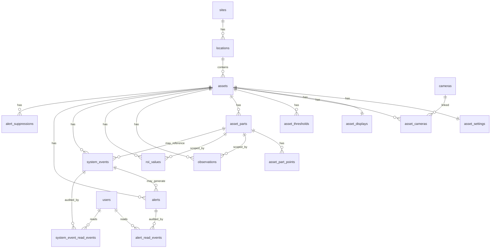

# CheckLabLive 앱 구조 기반 DB 설계 트리맵

작성일: 2026-05-18  
대상: DB/백엔드 개발자  
기준 코드: `src/app/site`, `src/app/layouts`, `src/app/monitoring/services`, `src/app/api/asset-dashboard`

## 1. 목적

이 문서는 현재 프론트 앱 구조를 기준으로 DB 설계자가 테이블 생성, 컬럼 추가, API 응답 설계를 할 때 필요한 정보를 정리한다.

현재 UI 용어는 `공정 > 위치 > 설비`이고, 코드의 도메인 이름은 `site > location > asset`이다. `asset`은 설비를 뜻하고, 설비의 특정 부위(예: 단자부, 베어링, 밸브 접점)는 `part`로 부른다. 라우트와 API 키는 이미 `site_id`, `locationId`, `asset_id`를 사용하므로 DB/API도 이 키 이름을 우선 맞추는 것이 좋다.

## 2. 앱 구조 트리맵

```text
src/app
├─ site
│  ├─ page.tsx
│  │  └─ 공정 구성 화면
│  │     - 공정, 위치, 설비를 단계별로 등록/수정/삭제
│  │     - 현재 저장소: localStorage `checklab:site-builder-sites`
│  │     - DB 후보: sites, locations, assets, media_files
│  │
│  ├─ utils/backend-workflow.ts
│  │  └─ 백엔드 관제 트리 기반 공정/위치/설비 뷰 모델 변환
│  │     - 공정/위치/설비 목록은 `GET /api/v1/monitoring-tree` 응답을 사용
│  │     - DB 후보: sites, locations, assets
│  │
│  ├─ [site_id]/page.tsx
│  │  └─ 공정 요약 화면
│  │     - 공정 상세, 위치 수, 설비 수, 주요 알림 수
│  │     - DB/API 필요: site 상세 + location 목록 + asset 상태 집계 + alert 집계
│  │
│  └─ [site_id]/location/[locationId]
│     ├─ page.tsx
│     │  └─ 위치 요약/설비 관리 화면
│     │     - 위치 상세, 하위 설비 카드, 설비 등록, 설비 옵션 수정, 설비 제거
│     │     - 현재 저장소: localStorage `checklab:location-assets:{site_id}:{locationId}`
│     │     - DB 후보: assets, asset_settings, asset_thresholds, cameras, asset_cameras
│     │
│     └─ asset/[asset_id]
│        ├─ page.tsx
│        │  └─ 설비 상세 대시보드 서버 진입점
│        │     - route params로 site/location/asset 검증
│        │     - CheckLab API snapshot 로드 후 화면용 snapshot으로 변환
│        │
│        ├─ status/page.tsx, history/page.tsx, control/page.tsx
│        │  └─ 현재 설비 상세로 redirect
│        │
│        └─ components
│           ├─ asset-dashboard-page.tsx
│           │  └─ 5초 갱신, 임계치 저장, 파트, 이벤트/전역 알림 상태 관리
│           └─ panels
│              ├─ asset-summary-panel.tsx
│              ├─ asset-camera-panel.tsx
│              ├─ asset-trend-panel.tsx
│              └─ asset-event-log-panel.tsx
│
├─ monitoring
│  ├─ services
│  │  ├─ asset-dashboard-api.ts
│  │  │  └─ GET /api/v1/assets/{asset_id}/mock-dashboard 계약
│  │  ├─ asset-threshold-api.ts
│  │  │  └─ GET/PUT /api/v1/assets/{asset_id}/thresholds 계약
│  │  ├─ asset-alerts-api.ts
│  │  │  └─ alerts, alerts/summary, alert read, suppression 계약
│  │  ├─ asset-events-api.ts
│  │  │  └─ system event timeline/read 계약
│  │  ├─ dashboard-asset-context.ts
│  │  │  └─ alert asset_id -> site/location/asset 트리 문맥 보강
│  │  └─ mock-dashboard-table-map.ts
│  │     └─ 대시보드 화면 영역과 백엔드 테이블 매핑 힌트
│  │
│  ├─ alarms/page.tsx
│  │  └─ 알림 화면
│  └─ realtime/[asset_id]/page.tsx
│     └─ site 트리에 없는 CheckLab asset fallback
│
├─ api/asset-dashboard
│  ├─ [asset_id]/route.ts
│  │  └─ 설비 대시보드 snapshot 프론트 프록시
│  ├─ [asset_id]/thresholds/route.ts
│  │  └─ 임계치 조회/저장 프론트 프록시
│  ├─ [asset_id]/alerts/route.ts
│  │  └─ 설비별 알림 프론트 프록시
│  ├─ [asset_id]/events/route.ts
│  │  └─ 설비별 이벤트 프론트 프록시
│  ├─ alerts, alerts/summary, alerts/read, alerts/[alertId]/read
│  │  └─ 전역 알림/읽음 프론트 프록시
│  ├─ alerts/suppression/route.ts
│  │  └─ 반복 알림 숨김 프론트 프록시
│  └─ monitoring-tree/route.ts
│     └─ alert 기반 모니터링 트리 생성
│
├─ layouts
│  └─ main-layout, side-menu, global-notifications, shared types
│     - DB/API 필요: monitoring tree, unread alert summary, dashboard header state
│
├─ auth/login
│  └─ 로그인 화면
│
├─ admin
│  └─ 현재 placeholder
│
└─ settings
   └─ 현재 placeholder
```

## 3. 도메인 트리맵

```text
공정 Site (`site_id`)
├─ 위치 Location (`location_id` / route: `locationId`)
│  ├─ 설비 Asset (`asset_id`)
│  │  ├─ 설비 표시 메타 AssetDisplay
│  │  ├─ 설비 운영 옵션 AssetSetting
│  │  ├─ 카메라 Camera / AssetCamera
│  │  ├─ 임계치 AssetThreshold
│  │  ├─ 파트 AssetPart (`part_id`)
│  │  │  ├─ 점 좌표 AssetPartPoint
│  │  │  └─ ROI 좌표 AssetPartRoi
│  │  ├─ 실측 시계열
│  │  │  ├─ Observations: 초음파/일반 센서 값
│  │  │  └─ RoiValues: 열화상 ROI avg/min/max
│  │  ├─ 이벤트 SystemEvent
│  │  └─ 알림 Alert
│  └─ 위치별 설비 집계
└─ 공정별 위치/설비/알림 집계
```

프론트에서 `site`는 화면 문구상 공정 단위다. DB와 백엔드 도메인도 `sites`, `site_id`를 기준으로 통일한다.

## 4. 핵심 엔티티 관계



## 5. 현재 샘플 마스터 데이터

### 공정 Site

| site_id            | name      | status    | locationCount | assetCount | alertCount |
| ------------------ | --------- | --------- | ------------: | ---------: | ---------: |
| `compression-site` | 압축 공정 | `danger`  |             3 |          6 |          3 |
| `cooling-site`     | 냉각 공정 | `warning` |             3 |          5 |          1 |
| `heating-site`     | 가열 공정 | `normal`  |             2 |          4 |          0 |

### 위치 Location

| location_id             | site_id            | name              | floor | status    |
| ----------------------- | ------------------ | ----------------- | ----- | --------- |
| `machine-room`          | `compression-site` | 1층 기계실        | 1F    | `normal`  |
| `electric-room`         | `compression-site` | 2층 전기실        | 2F    | `danger`  |
| `pipe-room-compression` | `compression-site` | 지하 배관실       | B1    | `caution` |
| `cooling-tower-zone`    | `cooling-site`     | 옥상 냉각탑 구역  | RF    | `normal`  |
| `pump-room-cooling`     | `cooling-site`     | 1층 냉각수 펌프실 | 1F    | `warning` |
| `boiler-room`           | `heating-site`     | 보일러실          | B1    | `normal`  |

### 설비 Asset

| asset_id                      | site_id            | location_id             | name              | type      | status    |
| ----------------------------- | ------------------ | ----------------------- | ----------------- | --------- | --------- |
| `asset-distribution-panel-01` | `compression-site` | `electric-room`         | 배전반 1호기      | 전기 설비 | `danger`  |
| `asset-transformer-01`        | `compression-site` | `electric-room`         | 변압기            | 전기 설비 | `warning` |
| `asset-compressor-01`         | `compression-site` | `machine-room`          | 압축기 1호기      | 회전 설비 | `normal`  |
| `asset-pump-01`               | `compression-site` | `machine-room`          | 펌프 1호기        | 회전 설비 | `normal`  |
| `asset-valve-zone-b`          | `compression-site` | `pipe-room-compression` | 밸브 구역 B       | 배관 설비 | `caution` |
| `asset-cooling-water-pump-02` | `cooling-site`     | `pump-room-cooling`     | 냉각수 펌프 2호기 | 회전 설비 | `warning` |
| `asset-boiler-01`             | `heating-site`     | `boiler-room`           | 보일러 1호기      | 가열 설비 | `normal`  |

주의: 샘플의 `assetCount`, `locationCount`, `alertCount`는 저장 컬럼보다 조회 집계값으로 두는 편이 안전하다.

## 6. 권장 테이블과 컬럼

### 6.1 `sites`

공정/현장 최상위 단위다.

| 컬럼                       | 타입 예시            | 설명                                              |
| -------------------------- | -------------------- | ------------------------------------------------- |
| `site_id`                  | varchar PK           | 라우트 `/site/{site_id}` 키                       |
| `name`                     | varchar              | 공정명                                            |
| `description`              | text nullable        | 공정 설명                                         |
| `status`                   | varchar              | `normal`, `caution`, `warning`, `danger`, `error` |
| `image_url`                | text nullable        | 공정 구성 화면의 대표 이미지                      |
| `sort_order`               | int                  | 표시 순서                                         |
| `created_at`, `updated_at` | timestamptz          | 감사 시각                                         |
| `deleted_at`               | timestamptz nullable | soft delete 권장                                  |

### 6.2 `locations`

공정 하위 위치다.

| 컬럼                                     | 타입 예시        | 설명                                                         |
| ---------------------------------------- | ---------------- | ------------------------------------------------------------ |
| `location_id`                            | varchar PK       | route `locationId`, 현재 샘플의 `id`/builder의 `location_id` |
| `site_id`                                | varchar FK       | `sites.site_id`                                              |
| `name`                                   | varchar          | 위치명                                                       |
| `floor`                                  | varchar nullable | 층 정보                                                      |
| `summary`                                | text nullable    | 위치 요약                                                    |
| `status`                                 | varchar          | 위치 상태                                                    |
| `image_url`                              | text nullable    | 위치 대표 이미지                                             |
| `sort_order`                             | int              | 표시 순서                                                    |
| `created_at`, `updated_at`, `deleted_at` | timestamptz      | 감사/삭제 시각                                               |

권장 unique: `(site_id, location_id)`

### 6.3 `assets`

설비 master이자 CheckLab API 자산이다. 프론트 라우트와 API는 `asset_id`를 기준 키로 사용한다.

| 컬럼                                     | 타입 예시            | 설명                                       |
| ---------------------------------------- | -------------------- | ------------------------------------------ |
| `asset_id`                               | varchar PK           | route `/asset/{asset_id}`, CheckLab API 키 |
| `site_id`                                | varchar FK           | 빠른 조회용. `location_id`로도 추론 가능   |
| `location_id`                            | varchar FK           | `locations.location_id`                    |
| `name`                                   | varchar              | 설비명                                     |
| `type`                                   | varchar              | 회전/전기/배관/가열/냉각 설비 등           |
| `status`                                 | varchar              | 현재 상태                                  |
| `operation_state`                        | varchar nullable     | `가동중`, `비가동`                         |
| `asset_code`                             | varchar nullable     | 예: `EQ-CP-001`                            |
| `asset_number`                           | varchar nullable     | 자산 번호                                  |
| `serial_number`                          | varchar nullable     | 시리얼                                     |
| `model_name`                             | varchar nullable     | 모델명                                     |
| `manager`                                | varchar nullable     | 담당자                                     |
| `emergency_contact`                      | varchar nullable     | 긴급 연락처                                |
| `last_inspection_date`                   | date nullable        | 최근 점검일                                |
| `last_collected_at`                      | timestamptz nullable | 최근 수집 시각                             |
| `image_url`                              | text nullable        | 설비 대표 이미지                           |
| `created_at`, `updated_at`, `deleted_at` | timestamptz          | 감사/삭제 시각                             |

권장 unique: `asset_id`는 PK로 단일 기준 키를 유지하고, 업무 코드가 별도로 필요하면 `(site_id, location_id, asset_code)` unique를 검토한다.

### 6.4 `asset_settings`

위치 화면에서 현재 localStorage로만 관리하는 설비 운영 옵션이다.

| 컬럼                   | 타입 예시            | 설명              |
| ---------------------- | -------------------- | ----------------- |
| `asset_id`             | varchar PK/FK        | `assets.asset_id` |
| `collection_cycle_sec` | int default 5        | 수집 주기         |
| `alarm_linked`         | boolean default true | 알림 연동 여부    |
| `primary_camera_id`    | varchar nullable     | 기본 카메라       |
| `updated_by`           | varchar nullable     | 수정자            |
| `updated_at`           | timestamptz          | 수정 시각         |

### 6.5 `cameras`, `asset_cameras`

설비 등록/옵션 화면의 `cameraId`와 상세 대시보드 영상 feed를 정규화한다.

`cameras`

| 컬럼                       | 타입 예시        | 설명                    |
| -------------------------- | ---------------- | ----------------------- |
| `camera_id`                | varchar PK       | 카메라 ID               |
| `name`                     | varchar          | 표시명                  |
| `stream_url`               | text nullable    | 영상 URL                |
| `stream_state`             | varchar nullable | `live`, `idle`, `error` |
| `stream_message`           | text nullable    | 상태 메시지             |
| `created_at`, `updated_at` | timestamptz      | 감사 시각               |

`asset_cameras`

| 컬럼         | 타입 예시  | 설명             |
| ------------ | ---------- | ---------------- |
| `asset_id`   | varchar FK | 설비             |
| `camera_id`  | varchar FK | 카메라           |
| `is_primary` | boolean    | 기본 카메라 여부 |
| `sort_order` | int        | 표시 순서        |

복합 PK: `(asset_id, camera_id)`

### 6.6 `asset_displays`

대시보드 표시 라벨 메타데이터다.

| 컬럼                       | 타입 예시        | 설명                 |
| -------------------------- | ---------------- | -------------------- |
| `asset_id`                 | varchar PK/FK    | 설비                 |
| `breadcrumb`               | varchar nullable | `공정 > 위치 > 설비` |
| `location_label`           | varchar nullable | 상세 상단 위치 라벨  |
| `camera_name`              | varchar nullable | 기본 카메라 표시명   |
| `thermal_chart_title`      | varchar nullable | 온도 차트 제목       |
| `acoustic_chart_title`     | varchar nullable | 초음파 차트 제목     |
| `created_at`, `updated_at` | timestamptz      | 감사 시각            |

### 6.7 `asset_thresholds`

설비 단위 온도/초음파 임계치다.

| 컬럼              | 타입 예시            | 설명                  |
| ----------------- | -------------------- | --------------------- |
| `threshold_id`    | uuid PK              | 임계치 row            |
| `asset_id`        | varchar FK           | 설비                  |
| `sensor_type`     | varchar              | `thermal`, `acoustic` |
| `threshold_level` | varchar              | `warn`, `critical`    |
| `threshold`       | numeric              | 임계값                |
| `unit`            | varchar              | `℃`, `dB`             |
| `is_configured`   | boolean default true | 미설정 상태 지원      |
| `updated_by`      | varchar nullable     | 수정자                |
| `updated_at`      | timestamptz          | 수정 시각             |

권장 unique: `(asset_id, sensor_type, threshold_level)`  
검증: 같은 `sensor_type`에서 `critical >= warn`

프론트 PUT 요청 필드:

```json
{
  "temperature_warn_c": 72,
  "temperature_critical_c": 80,
  "acoustic_warn_db": 88,
  "acoustic_critical_db": 96,
  "updated_by": "frontend-user-id"
}
```

### 6.8 `asset_parts`, `asset_part_points`

카메라/센서 파트 설정이다. 현재 API에 좌표가 없으면 프론트가 임시 좌표를 만든다. DB에서 제공하는 것이 좋다.

`asset_parts`

| 컬럼                                        | 타입 예시            | 설명                   |
| ------------------------------------------- | -------------------- | ---------------------- |
| `part_id`                                   | varchar PK           | 파트 ID                |
| `asset_id`                                  | varchar FK           | 설비                   |
| `label`                                     | varchar              | 파트명                 |
| `sensor_type`                               | varchar              | `thermal`, `acoustic`  |
| `source_metric`                             | varchar nullable     | 원천 metric key        |
| `unit`                                      | varchar nullable     | 단위                   |
| `threshold_value`                           | numeric nullable     | 파트별 임계치 override |
| `linked_alarm`                              | boolean default true | 파트 알림 연동         |
| `selection_mode`                            | varchar              | `area`, `points`       |
| `roi_x`, `roi_y`, `roi_width`, `roi_height` | numeric nullable     | ROI 사각형             |
| `sort_order`                                | int                  | 표시 순서              |
| `created_at`, `updated_at`                  | timestamptz          | 감사 시각              |

`asset_part_points`

| 컬럼         | 타입 예시  | 설명          |
| ------------ | ---------- | ------------- |
| `point_id`   | varchar PK | 좌표 ID       |
| `part_id`    | varchar FK | 파트          |
| `x_norm`     | numeric    | x 정규화 좌표 |
| `y_norm`     | numeric    | y 정규화 좌표 |
| `sort_order` | int        | 점 순서       |

좌표 단위는 0-1 또는 0-100 중 하나로 통일한다.

### 6.9 `observations`

초음파/일반 센서 시계열 원천이다.

| 컬럼             | 타입 예시           | 설명                                              |
| ---------------- | ------------------- | ------------------------------------------------- |
| `observation_id` | uuid PK             | 관측 row                                          |
| `asset_id`       | varchar FK          | 설비                                              |
| `part_id`        | varchar FK nullable | 파트                                         |
| `edge_id`        | varchar nullable    | 수집 엣지 설비                                    |
| `sensor_type`    | varchar             | `acoustic` 등                                     |
| `metric_key`     | varchar             | `average_db`, `peak_db`, `dominant_frequency_khz` |
| `value`          | numeric             | 측정값                                            |
| `unit`           | varchar             | 단위                                              |
| `observed_at`    | timestamptz         | 측정 시각                                         |
| `ingested_at`    | timestamptz         | 적재 시각                                         |

권장 인덱스: `(asset_id, sensor_type, observed_at desc)`, `(part_id, observed_at desc)`

### 6.10 `roi_values`

열화상 ROI 시계열 집계다.

| 컬럼           | 타입 예시           | 설명         |
| -------------- | ------------------- | ------------ |
| `roi_value_id` | uuid PK             | ROI 측정 row |
| `asset_id`     | varchar FK          | 설비         |
| `part_id`      | varchar FK nullable | 파트    |
| `avg`          | numeric             | 평균 온도    |
| `min`          | numeric nullable    | 최소 온도    |
| `max`          | numeric nullable    | 최대 온도    |
| `unit`         | varchar default `℃` | 단위         |
| `observed_at`  | timestamptz         | 측정 시각    |
| `ingested_at`  | timestamptz         | 적재 시각    |

권장 인덱스: `(asset_id, observed_at desc)`, `(part_id, observed_at desc)`

### 6.11 `system_events`

센서/엣지/ROI/시스템 이벤트 타임라인이다.

| 컬럼               | 타입 예시             | 설명                               |
| ------------------ | --------------------- | ---------------------------------- |
| `event_id`         | varchar PK            | 이벤트 ID                          |
| `asset_id`         | varchar FK            | 설비                               |
| `edge_id`          | varchar nullable      | 엣지 설비                          |
| `part_id`          | varchar nullable      | 관련 파트                     |
| `roi_id`           | varchar nullable      | ROI ID가 별도면 사용               |
| `event_type`       | varchar               | 이벤트 종류                        |
| `source_type`      | varchar               | `system`, `sensor`, `roi`, `alert` |
| `severity`         | varchar               | `normal`, `caution`, `abnormal`    |
| `message`          | text                  | 메시지                             |
| `x_norm`, `y_norm` | numeric nullable      | 발생 좌표                          |
| `observed_at`      | timestamptz           | 발생 시각                          |
| `is_read`          | boolean default false | 읽음 여부                          |
| `read_at`          | timestamptz nullable  | 읽은 시각                          |
| `read_by`          | varchar nullable      | 읽은 사용자                        |

권장 인덱스: `(asset_id, observed_at desc)`, `(asset_id, is_read, observed_at desc)`

### 6.12 `alerts`

사용자 확인이 필요한 알림이다. 전역 알림과 설비 이벤트 로그에서 함께 사용한다.

| 컬럼              | 타입 예시             | 설명                                            |
| ----------------- | --------------------- | ----------------------------------------------- |
| `alert_id`        | varchar PK            | 알림 ID                                         |
| `asset_id`        | varchar FK            | 설비                                            |
| `source_event_id` | varchar FK nullable   | 원천 system event                               |
| `severity`        | varchar               | `caution`, `warning`, `critical`, `abnormal` 등 |
| `message`         | text                  | 메시지                                          |
| `created_at`      | timestamptz           | 발생 시각                                       |
| `is_read`         | boolean default false | 읽음 여부                                       |
| `read_at`         | timestamptz nullable  | 읽은 시각                                       |
| `read_by`         | varchar nullable      | 읽은 사용자                                     |
| `resolved_at`     | timestamptz nullable  | 해소 시각                                       |
| `resolved_by`     | varchar nullable      | 해소 사용자                                     |

전역 알림 API는 `asset_name`, `asset_id`, `location_label`, `dashboard_href`, `dashboard_status`를 조인해서 내려주면 좋다.

권장 인덱스:

- `(is_read, created_at desc)`
- `(asset_id, created_at desc)`
- `(asset_id, is_read, created_at desc)`
- `(severity, is_read, created_at desc)`

### 6.13 읽음/숨김/사용자 테이블

`alert_read_events`

| 컬럼            | 타입 예시   | 설명      |
| --------------- | ----------- | --------- |
| `read_event_id` | uuid PK     | 감사 row  |
| `alert_id`      | varchar FK  | 알림      |
| `read_by`       | varchar     | 사용자 ID |
| `read_at`       | timestamptz | 읽음 시각 |

`system_event_read_events`

| 컬럼            | 타입 예시   | 설명      |
| --------------- | ----------- | --------- |
| `read_event_id` | uuid PK     | 감사 row  |
| `event_id`      | varchar FK  | 이벤트    |
| `read_by`       | varchar     | 사용자 ID |
| `read_at`       | timestamptz | 읽음 시각 |

`alert_suppressions`

| 컬럼               | 타입 예시     | 설명      |
| ------------------ | ------------- | --------- |
| `suppression_id`   | uuid PK       | 숨김 ID   |
| `asset_id`         | varchar FK    | 설비      |
| `duration_seconds` | int           | 숨김 시간 |
| `reason`           | text nullable | 사유      |
| `suppressed_by`    | varchar       | 사용자 ID |
| `created_at`       | timestamptz   | 생성 시각 |
| `suppressed_until` | timestamptz   | 만료 시각 |

`users`

| 컬럼                       | 타입 예시        | 설명          |
| -------------------------- | ---------------- | ------------- |
| `user_id`                  | varchar PK       | 사용자 ID     |
| `name`                     | varchar          | 표시명        |
| `role`                     | varchar          | 관리자/운영자 |
| `email`                    | varchar nullable | 이메일        |
| `created_at`, `updated_at` | timestamptz      | 감사 시각     |

현재 프론트는 임시 사용자 `frontend-user-id`를 보낸다.

### 6.14 `media_files` 또는 이미지 컬럼

공정 구성 화면은 공정/위치/설비에 `imageUrl`을 가진다. 단순 URL이면 각 master 테이블의 `image_url` 컬럼으로 충분하다. 업로드 파일을 관리해야 하면 별도 테이블을 권장한다.

| 컬럼         | 타입 예시        | 설명                        |
| ------------ | ---------------- | --------------------------- |
| `file_id`    | uuid PK          | 파일 ID                     |
| `owner_type` | varchar          | `site`, `location`, `asset` |
| `owner_id`   | varchar          | 대상 ID                     |
| `url`        | text             | 접근 URL                    |
| `mime_type`  | varchar nullable | MIME                        |
| `created_at` | timestamptz      | 생성 시각                   |

## 7. 프론트 API 계약

프론트 내부 프록시는 `/api/asset-dashboard/*`이고, 실제 백엔드 원천 API는 `/api/v1/*` 형태를 기대한다.

| 프론트 프록시                                    | 백엔드 원천 API                                                     | 원천 테이블                                                                                         |
| ------------------------------------------------ | ------------------------------------------------------------------- | --------------------------------------------------------------------------------------------------- |
| `GET /api/asset-dashboard/{asset_id}`            | `GET /api/v1/assets/{asset_id}/mock-dashboard` + 보조 API 병렬 호출 | assets, asset_displays, metric configs, thresholds, asset_parts, observations, roi_values, alerts, system_events |
| `GET /api/asset-dashboard/{asset_id}/thresholds` | `GET /api/v1/assets/{asset_id}/thresholds`                          | asset_thresholds                                                                                    |
| `PUT /api/asset-dashboard/{asset_id}/thresholds` | `PUT /api/v1/assets/{asset_id}/thresholds`                          | asset_thresholds                                                                                    |
| `GET /api/asset-dashboard/{asset_id}/alerts`     | `GET /api/v1/alerts?asset_id=...`                                   | alerts                                                                                              |
| `GET /api/asset-dashboard/{asset_id}/events`     | `GET /api/v1/assets/{asset_id}/events`                              | system_events                                                                                       |
| `GET /api/asset-dashboard/alerts`                | `GET /api/v1/alerts`                                                | alerts + asset 조인                                                                                 |
| `GET /api/asset-dashboard/alerts/summary`        | `GET /api/v1/alerts/summary`                                        | alerts 집계                                                                                         |
| `PUT /api/asset-dashboard/alerts/{alertId}/read` | `PUT /api/v1/alerts/{alertId}/read`                                 | alerts, alert_read_events                                                                           |
| `PUT /api/asset-dashboard/alerts/read`           | `PUT /api/v1/alerts/read`                                           | alerts, alert_read_events                                                                           |
| `POST /api/asset-dashboard/alerts/suppression`   | `POST /api/v1/alert-suppressions`                                   | alert_suppressions                                                                                  |
| `PUT /api/asset-dashboard/events/{eventId}/read` | `PUT /api/v1/events/{eventId}/read`                                 | system_events, system_event_read_events                                                             |
| `GET /api/asset-dashboard/monitoring-tree`       | 권장: `GET /api/v1/monitoring-tree`                                 | sites, locations, assets, alerts 집계                                                               |

### `mock-dashboard` 응답 필드

| 필드                | 설명                                              | DB 원천                                          |
| ------------------- | ------------------------------------------------- | ------------------------------------------------ |
| `asset_id`          | 설비/자산 ID                                      | assets                                           |
| `header`            | 설비명, 경로, 위치, 상태, 최근 수집 시각, 알림 수 | assets, locations, sites, asset_displays, alerts |
| `camera`            | 카메라 ID/이름/스트림 상태/URL                    | cameras, asset_cameras, asset_displays           |
| `summary_cards`     | 온도/초음파 KPI 카드                              | observations, roi_values, asset_thresholds       |
| `monitored_parts`   | 파트별 현재값. 기존 `monitored_regions`는 legacy 호환 필드로만 사용 | asset_parts, observations, roi_values            |
| `threshold_panel`   | warn/critical 임계치                              | asset_thresholds                                 |
| `trend_charts`      | 온도/초음파 시계열                                | observations, roi_values                         |
| `alerts`            | 알림 목록                                         | alerts                                           |
| `event_timeline`    | 이벤트 목록                                       | system_events                                    |
| `recent_events`     | fallback 이벤트                                   | alerts, system_events                            |

## 8. 화면별 DB 요구사항

| 화면                | 라우트                                                   | 필요한 조회/저장                                                                                |
| ------------------- | -------------------------------------------------------- | ----------------------------------------------------------------------------------------------- |
| 공정 구성           | `/site`                                                  | 공정/위치/설비 CRUD, 이미지 저장, 상태 선택                                                     |
| 공정 요약           | `/site/{site_id}`                                        | site 상세, 하위 locations, 하위 assets 상태 집계, alert count                                   |
| 위치 요약/설비 관리 | `/site/{site_id}/location/{locationId}`                  | location 상세, asset 목록, asset 생성/수정/삭제, camera 연결, 수집 주기, 알림 연동, 임계치 저장 |
| 설비 상세           | `/site/{site_id}/location/{locationId}/asset/{asset_id}` | dashboard snapshot, threshold 저장, 파트 표시/수정, trend, alert/event read                     |
| 전역 레이아웃       | 모든 MainLayout                                          | monitoring tree, unread alert summary, dashboard header state                                   |
| fallback 실시간     | `/monitoring/realtime/{asset_id}`                        | site/location에 매핑되지 않은 asset snapshot                                                    |

## 9. 상태/Enum 후보

| 구분               | 값                                                                                |
| ------------------ | --------------------------------------------------------------------------------- |
| `dashboard_status` | `normal`, `caution`, `warning`, `danger`, `error`                                 |
| API 호환 상태      | `normal`, `caution`, `warning`, `danger`, `critical`, `error`, `high`, `abnormal` |
| 이벤트 등급        | `normal`, `caution`, `abnormal`                                                   |
| 알림 등급          | `normal`, `caution`, `warning`, `critical`, `danger`, `high`, `abnormal`          |
| 센서 타입          | `thermal`, `acoustic`                                                             |
| 임계 레벨          | `warn`, `critical`                                                                |
| 파트 방식          | `area`, `points`                                                                  |
| 운전 상태          | `가동중`, `비가동`                                                                |

프론트 변환 규칙:

- `critical`, `danger`, `high`, `abnormal`, `위험`, `이상`은 위험/이상급
- `warning`, `medium`은 경고
- `caution`, `주의`, `요주의`, `높음`은 요주의
- 그 외는 기본 `normal`

## 10. 우선 구현 순서

1. `sites`, `locations`, `assets` 마스터와 목록/상세 API
2. 위치 화면의 localStorage 대체: asset CRUD, `asset_settings`, `asset_thresholds`, camera 연결
3. 설비 상세 snapshot: `asset_displays`, `asset_thresholds`, `observations`, `roi_values`, `asset_parts`
4. 운영 이벤트/알림: `system_events`, `alerts`, read audit, suppression
5. 전역 UX: `GET /api/v1/monitoring-tree`, `GET /api/v1/alerts/summary`
6. 사용자/권한: `users`, role, audit `updated_by/read_by`

## 11. DB 개발자 체크리스트

- `asset_id`를 프론트 라우트와 CheckLab API의 단일 기준 키로 유지한다.
- `site_id`, `location_id`, `asset_id`로 `href`를 API에서 생성한다. `href`를 DB에 중복 저장하지 않는 편이 좋다.
- `locationId`는 프론트 라우트 이름이고 DB 컬럼은 `location_id`로 통일한다.
- 현재 localStorage에 있는 등록/수정 상태는 DB/API로 이전해야 한다.
- 모든 시계열/이벤트/알림 시각은 `timestamptz`로 저장하고 API는 ISO 문자열로 반환한다.
- 전역 알림은 5초 폴링될 수 있으므로 `alerts.is_read=false` 조회 인덱스가 필요하다.
- 읽음 처리는 원본 row 업데이트와 감사 row insert를 한 트랜잭션으로 처리한다.
- 임계치 저장 시 `critical >= warn`을 검증한다.
- 파트 좌표는 0-1 또는 0-100 중 하나로 고정한다.
- `mock-dashboard`는 일부 값이 없어도 빈 배열/null을 안정적으로 반환해야 한다.

## 12. 참고 소스

- 공정/위치/설비 백엔드 변환: `src/app/site/utils/backend-workflow.ts`
- 관제 트리 API 정규화: `src/app/monitoring/services/monitoring-tree-api.ts`
- 공정 구성 화면: `src/app/site/components/site-index-page.tsx`
- 위치 설비 관리 화면: `src/app/site/[site_id]/location/[locationId]/components/location-summary-page.tsx`
- 설비 상세 화면: `src/app/site/[site_id]/location/[locationId]/asset/[asset_id]/components/asset-dashboard-page.tsx`
- 화면 공통 타입: `src/app/layouts/types.ts`
- 설비 대시보드 API 타입: `src/app/monitoring/services/asset-dashboard-api.ts`
- API 응답 어댑터: `src/app/monitoring/services/asset-dashboard-adapter.ts`
- 알림 API 타입: `src/app/monitoring/services/asset-alerts-api.ts`
- 이벤트 API 타입: `src/app/monitoring/services/asset-events-api.ts`
- 임계치 API 타입: `src/app/monitoring/services/asset-threshold-api.ts`
- 프론트 API 프록시: `src/app/api/asset-dashboard`
- 화면/테이블 매핑 힌트: `src/app/monitoring/services/mock-dashboard-table-map.ts`
